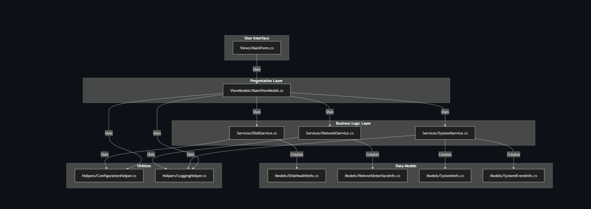

# ScanningTool


## Overview

ScanningTool is a comprehensive Windows desktop application designed for system diagnostics and forensic analysis. It provides IT professionals and system administrators with a suite of tools to analyze system health, network status, and create disk images for forensic purposes. With integrated AI error log analysis, ScanningTool also offers intelligent solution suggestions for system issues.

## Features

- **Disk Health Analysis**: Check the health status of all connected disk drives
- **System Age Detection**: Determine the installation date and age of the operating system
- **System Error Analysis**: Retrieve and analyze system errors from event logs
- **AI-driven Error Analysis**: Get intelligent solution suggestions for system errors using OpenAI
- **Warning Detection**: Identify system warnings that might require attention
- **Network Information**: Gather detailed information about network interfaces and their status
- **Disk Imaging**: Create forensic disk images for analysis and backup
- **System Uptime**: Check how long the system has been running
- **Secure Configuration**: Encrypted storage of sensitive data such as API keys

## Screenshots


## Architecture

ScanningTool follows a layered architecture pattern to ensure separation of concerns and maintainability:



- **Models**: Data structures representing system entities
- **Services**: Business logic and system interaction components
- **ViewModels**: Presentation logic connecting the UI with services
- **Views**: User interface components
- **Helpers**: Utility classes for configuration, logging, security, etc.

## AI Integration

ScanningTool uses OpenAI to analyze system errors and provide intelligent solution suggestions:

- **Error Log Analysis**: Analyzes system events and error messages to identify root causes
- **Solution Suggestions**: Provides concrete recommendations to solve identified problems
- **Technical Context**: Understands system context and provides relevant technical solutions
- **Secure API Handling**: Encrypted storage of API keys and secure communication

To use the AI functionality:
1. Configure your OpenAI API key in the settings
2. Analyze system errors or events
3. Click on "Analyze with AI" to get intelligent solution suggestions

## Technologies

- **C# 10.0**: Modern language features for clean, concise code
- **.NET 8.0**: Latest framework for Windows desktop applications
- **Windows Forms**: UI framework for desktop applications
- **System.Management**: WMI access for system information
- **Dependency Injection**: Loose coupling for better testability
- **Asynchronous Programming**: Non-blocking operations for responsive UI
- **OpenAI API**: AI-driven analysis of system errors
- **Unit Testing**: MSTest framework for automated testing
- **Encryption**: Secure storage of sensitive data

## Getting Started

### Prerequisites

- Windows 10/11
- .NET 8.0 SDK or later
- Visual Studio 2022 or later (recommended)
- OpenAI API key (for AI functionality)

### Installation

1. Clone this repository:
   ```
   git clone https://github.com/peiwasthama/ScanningTool.git
   ```

2. Open the solution in Visual Studio:
   ```
   cd ScanningTool
   start scanningTool.sln
   ```

3. Restore NuGet packages:
   - Right-click on the solution in Solution Explorer
   - Select "Restore NuGet Packages"

4. Build the solution:
   - Press F6 or select "Build Solution" from the Build menu

5. Run the application:
   - Press F5 to run with debugging, or Ctrl+F5 to run without debugging

### Configuration

ScanningTool supports configuration through an `appSettings.json` file placed in the application directory:

```json
{
  "DumpItPath": "C:\\Path\\To\\DumpIt.exe",
  "OutputFolderPath": "C:\\Path\\To\\Output\\Folder",
  "MaxEvents": 100,
  "OpenAIApiKey": "your-api-key-here"
}
```

You can also configure these settings through the settings interface in the application, which also offers secure encryption of the API key.

## Usage

### Checking Disk Health

1. Launch the application
2. Click the "Check Disk Health" button
3. Review the health status of all connected disks

### Creating a Disk Image

1. Ensure DumpIt.exe is available (configure path in settings)
2. Click the "Create Disk Image" button
3. Confirm the operation when prompted (requires administrator privileges)
4. Wait for the process to complete
5. The path to the created image will be displayed in the output

### Analyzing Network Information

1. Click the "Find Network Info" button
2. Review detailed information about all network interfaces
3. Pay special attention to interfaces marked as "Down"

### Using AI Error Analysis

1. Configure your OpenAI API key in the settings
2. Click the "System Errors" button to retrieve system errors
3. Select an error from the list
4. Click the "Analyze with AI" button
5. Wait while the AI analyzes the error
6. Review the solution suggestions presented

## Development

### Project Structure

```
ScanningTool/
├── Models/
│   ├── DiskHealthInfo.cs
│   ├── NetworkInterfaceInfo.cs
│   ├── SystemEventInfo.cs
│   └── SystemInfo.cs
├── Services/
│   ├── AIService.cs
│   ├── DiskService.cs
│   ├── NetworkService.cs
│   └── SystemService.cs
├── ViewModels/
│   └── MainViewModel.cs
├── Views/
│   ├── MainForm.cs
│   └── SettingsForm.cs
└── Helpers/
    ├── ConfigurationHelper.cs
    ├── LoggingHelper.cs
    └── SecurityHelper.cs
```

### Adding New Features

1. Define models in the Models directory
2. Implement service interfaces and classes in the Services directory
3. Update or create ViewModels to expose functionality to the UI
4. Create or modify Views to provide user interaction
5. Add appropriate unit tests

### Coding Standards

This project follows Microsoft's C# coding conventions:
- Use PascalCase for class names and public members
- Use camelCase for local variables and parameters
- Include XML documentation for all public members
- Follow the SOLID principles
- Write unit tests for all services

## Testing

The project includes unit tests for all service classes. To run the tests:

1. Open Test Explorer in Visual Studio
2. Click "Run All Tests" or select specific tests to run

## Contributing

Contributions are welcome! Please feel free to submit a Pull Request.

1. Fork the repository
2. Create your feature branch (`git checkout -b feature/amazing-feature`)
3. Commit your changes (`git commit -m 'Add some amazing feature'`)
4. Push to the branch (`git push origin feature/amazing-feature`)
5. Open a Pull Request

Please ensure your code follows the project's coding standards and includes appropriate tests.

## License

This project is licensed under the MIT License - see the [LICENSE](LICENSE) file for details.

## Acknowledgments

- [OpenAI](https://openai.com/) for the API that powers the AI error analysis
- [DumpIt](https://www.comae.com/) for the memory dump functionality
- Microsoft for the .NET framework and WMI capabilities
- All contributors who have helped improve this project

## Contact

Peiwast Hama - [peiwasthama@gmail.com](mailto:peiwasthama@gmail.com)

Project Link: [https://github.com/peiwasthama/ScanningTool](https://github.com/peiwasthama/ScanningTool)
